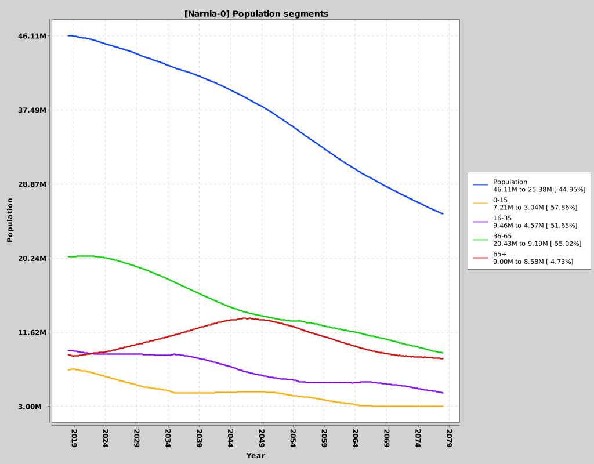
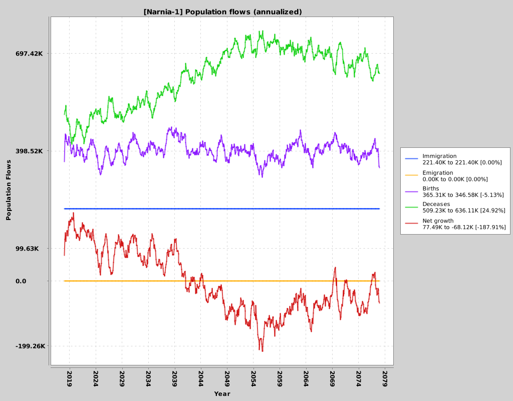

# Demographics of Narnia

The demographics of Narnia are the typical of a quickly aging western world population:

- Extremely low initial fertility rate (1.3) well below from the replacement level. 
- Life expectancy is very high.
- The impact of the baby boom four decades ago is clearly visible.

The goal of this initial simulation is to understand the different scenarios that may play out, 
with different policies that may be applied:

- [Scenario 0: Natural trends](#scenario-0)
- [Scenario 1: Current policies](#scenario-1)

### Scenario 0

**Goal**: Understand the natural trend of the population, with no changes or external inputs:
 
- No inbound or outbound migration flows.
- No changes in the population behaviour.

###### Initial conditions

###### Key results
The most meaningful results are the following

###### Browse all results

- [View CSV Data](../sim-results/Narnia-0/demography/series.csv)
- [View all simulation files](../sim-results/Narnia-0/demography)

###### Interpretation
Without any population inflow, there's a very strong trend to population decay and aging. 
Population age peaks around 2050. 

### Scenario 1
**Goal**: Understand current trend, with current policies.
 
- Migration flows are in line with current reality.
- No changes in population behaviour or general trends

###### Key results

###### Browse all results

- [View CSV Data](../sim-results/Narnia-1/demography/series.csv)
- [View all simulation files](../sim-results/Narnia-1/demography)

###### Interpretation
