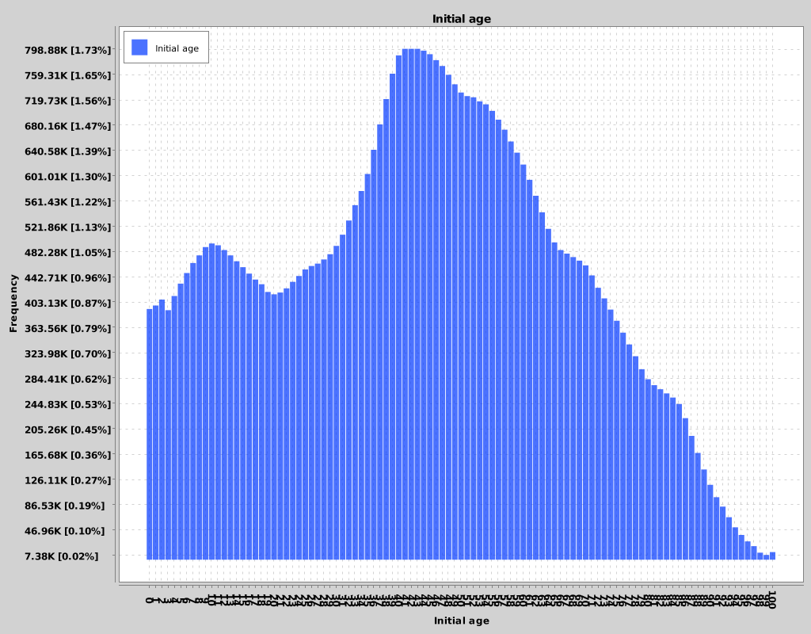
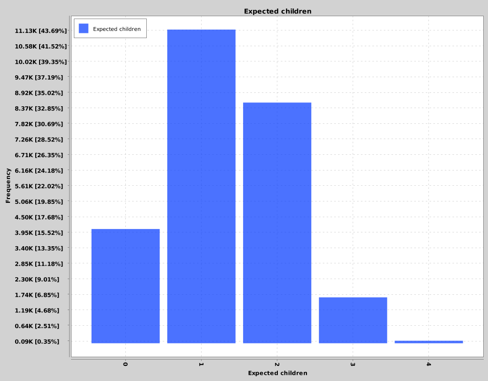

### Demographics of Narnia

The demographics of Narnia are the typical of old population, with a extremely low initial fertility rate (1.33). 
Also, life expectancy is high.

The goal of this initial simulation is to understand the different scenarios that may play out, with different policies applied:

### Scenario 0 - Natural trend of population 
- No inbound or outbound migration flows.
- No change in population behaviour.

###### Initial conditions

###### Key results
The most meaningful results are the following

###### Browse all results

- [Download CSV Data](../sim-results/Narnia-0/demography/series.csv)
- [View all simulation files](../sim-results/Narnia-0/demography)

###### Interpretation
Without any population inflow, there's a very strong trend to population decay and aging. 
Population age peaks around 2050

